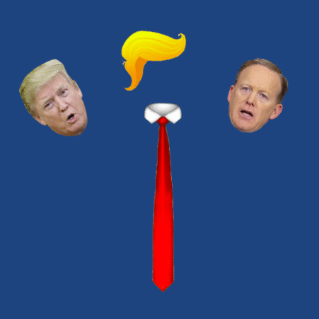
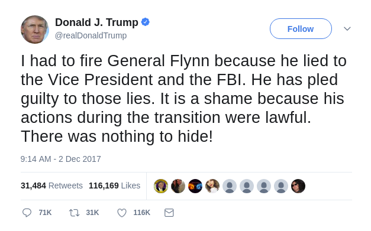
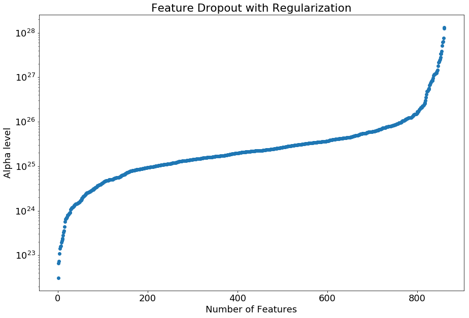

# Trump-Tweet Author Identification

This project is an attempt to build a model which can identify if Trump is truly the author of any given tweet on his account, or if it was written and posted by an aide. It is widely reported in the news that many of his tweets are actually written by staff. With particularly controversial tweets, and especially given that he sometimes makes presidential decrees through his Twitter account, it can be enlightening to have greater certainty in the authorship of his tweets.

Did Trump tweet it? Or just an aide in Trump clothing?

## Background
On December 1st, 2017, Michael Flynn pleaded guilty to lying to the FBI. The next day, Trump’s personal Twitter account tweeted:

The controversy arises because on February 14th of that year, the day after Flynn resigned, Trump had asked James Comey, then the director of the FBI, to back off any investigations of Flynn. If Trump knew at the time of his request to Comey that Flynn had indeed lied to the FBI, then Trump's tweet could be seen as evidence that Trump attempted to obstruct justice. After several legal experts argued this point, Trump defended himself by claiming that his lawyer John Dowd wrote and posted the tweet. But did he really?

***

Forensic text analysis was an early field in machine learning and has been used in cases as varied as identifying the Unabomber to discovering J.K. Rowling as the true identity of the author Robert Galbraith to determining the specific authors of each of the Federalist Papers. This project is an effort to use machine learning and these same techniques to identify tweets on [@realDonaldTrump](https://twitter.com/realdonaldtrump) as written by Trump himself or by his staff when using his account. This task, however, is particularly challenging due to the short nature of a tweet--there just isn't much signal to pick up in such a short text.

Prior to March 26, 2017, Trump was tweeting using a Samsung Galaxy device while his staff were tweeting using an iPhone. From this information provided in the metadata of each tweet, we know whether it was Trump himself or his staff tweeting (see [Further Reading](#further-reading) below for some articles discussing this assumption). After March however, Trump switched to using an iPhone as well, so identification of the tweeter cannot come from the metadata alone and must be deduced from the content of the tweet.

### Potential Tweeters

These individuals have been reported in the news as possible tweeters on Trump's Twitter account. The Start Date is the date their association with the Trump Campaign or Administration was announced, and the end date is when their positions were terminated.

|Name|Start Date|End Date|Twitter Handle|
|----|----------|--------|--------------|
|Donald Trump|2009-05-04|present|@realDonaldTrump|
|Sean Spicer|2016-12-22|2017-07-21|@seanspicer|
|Reince Priebus|2016-11-13|2017-07-27|@Reince|
|Steve Bannon|2016-08-17|2017-08-18|@SteveKBannon|
|Kellyanne Conway|2016-07-01|present|@KellyannePolls|
|Anthony Scaramucci|2017-07-21|2017-07-31|@Scaramucci|
|Dan Scavino|2015-06-01|present|@DanScavino|
|John Dowd|2017-07-16|present|N/A|

## Data

I used Brendan Brown's [Trump Tweet Data Archive](https://github.com/bpb27/trump_tweet_data_archive) to collect all tweets from the beginning of Trump's account in mid-2009 up until the end of 2017. This set consists of nearly 33,000 tweets. Even though I know from whose device a tweet originated, there is still some ambiguity around the authorship because Trump is known to dictate tweets to assistants, so a tweet may have Trump's characteristics but be posted from a non-Trump device, and also (especially during the campaign) to write tweets collaboratively with aides, making true authorship unclear.

## Feature engineering

### Style
I looked at the style of each tweet by counting various punctuation marks (the number of exclamation marks, for example), the number of @mentions and #hashtags, and average tweet/sentence/word length.

### Trump quirks
I also created features for what I have recognized as Trump's rather unique Twitter behavior. These features include the "quoted retweet" (where Trump copies and pastes a another user's tweet onto his own timeline and surrounds it in quotation marks), words written in ALL CAPS or followed by several exclamation points!!!, and also middle-of-the-night tweeting.

### Sentiment
I used C.J. Hutto's [VADER](https://github.com/cjhutto/vaderSentiment) package to extract the sentiment of each tweet. VADER, which stands for Valence Aware Dictionary and sEntiment Reasoning, is a lexicon and rule-based tool that is specifically tuned to social media. Given a string of text, it outputs a number between 0 and 1 for negativity, positivity, and neutrality
for the text, as well as a compound score from -1 to 1 which is an aggregate measure.

### Emotion
The National Research Council of Canada created a [lexicon](http://saifmohammad.com/WebPages/NRC-Emotion-Lexicon.htm) of over 14,000 words, each rated as belonging to any of 10 emotion classes. For each tweet, I counted the number of words for each emotion class and assigned the tweet that count score for each emotion.

### Word choice
I performed TF-IDF on the text of each tweet in order to pick up vocabulary unique to Trump or his staff.

### Grammatical structure
I knew the phrasing of Trump's tweets would stand out from that of his staff, so in order to capture this I performed part-of-speech replacement on each tweet, reducing it to a string of its parts of speech. For example, the phrase "Hello. This is a tweet which has been parsed for parts of speech" would be replaced with "UH . DT BZ DT NN WDT VBZ VBN VBN IN NNS IN NN ", using the [Penn part of speech tags](https://cs.nyu.edu/grishman/jet/guide/PennPOS.html).

## Models

I created models for Naive Bayes, SVM, Logistic Regression with Ridge Regularization, KNN, and the ensemble methods of Random Forest, Gradient Boosting, and AdaBoost. All models achieved accuracy, precision, and recall rates in the low 90%s, except for Naive Bayes which was in the mid 80%s. For my final model, I found that an ensemble of these individual models worked best.

Additionally, I used the Ridge Regularization to iteratively drive each of the roughly 900 feature coefficients to zero with ever increasing alpha values. This allowed me to rank each feature in order of its importance to the logistic regression model. At an alpha-level of 3e22, the first feature dropped out when its regression coefficient was driven to zero. Slowly, more features dropped out until an alpha-level of about 10e25, when the feature dropout rapidly increased. Above an alpha-level of 10e26, the dropout rate slowed down, and these features still left are the most influential features in the model.

## Results

One of the most interesting results from my analysis is the characteristics which identify a tweet as coming from Trump or from someone else. From my Ridge analysis, the top Trump features are:

* Quoted retweet
* @mentions
* Between 10pm and 10am
* Exclamations!!!
* ALL CAPS
* Tweet length: 114 characters
* @realDonaldTrump

The top features of non-Trump tweets are:

* True retweets
* The word “via”
* Between 10am and 4pm
* Semicolons
* Periods
* Tweet length: 103 characters
* @BarackObama

Trump's tweets are in general more emotive than his aides' tweets, exhibiting high scores for the emotions surprise, anger, negativity, disgust, joy, sadness, and fear. Non-Trump tweets, in contrast, are relatively unemotional, and feature many URLs, hashtags, and organization names.

As for the models, Random Forest performed the best on its own, with AdaBoost a close second. Naive Bayes performed most poorly of the models tested.

|   |Gradient Boosting|Random Forest|AdaBoost|Logistic Regression|KNN|SVM|Naive Bayes|
|---:|:--------------:|:-----------:|:------:|:-------------:|:---:|:---:|:---------:|
|Accuracy|95%|94%|92%|90%|90%|90%|84%|
|Precision|95%|94%|92%|90%|91%|90%|83%|
|Recall|95%|95%|90%|88%|89%|90%|82%|

For my final model, I created an ensemble of all seven models, using the majority class as my predictor.

## The Flynn Tweet

And as for that Flynn Tweet? My analysis indicates it was most likely not written by Trump. However, my models are split evenly on this one. Some predict Trump, others not Trump. The Logistic Regression outputs a probability estimate of 97% and Naive Bayes of 94% that it did indeed come from Trump. Correspondingly, the [/@RPMMAS](https://twitter.com/RPMMAS) twitter account performed an informal poll of its users and received almost 2000 responses, with 96% indicating they believed the tweet to have come from Trump:

A word of caution though: not all of my models individually agreed on this one. Specifically, AdaBoost, KNN, and SVM indicated that it is a non-Trump tweet. Random Forest, Naive Bayes, and Logistic Regression all output Trump as the author. In my opinion, after reviewing thousands of Trump tweets throughout this project and evaluating all features which describe his tweets, I find the topic, sentiment, and emotion very much to be Trumpian, while the phrasing, grammar, and style all indicate another author. I believe the tweet was written collaboratively, with Trump providing the topical features of the tweet and an unknown author actually composing it.

## Sources

*Many thanks to the following packages and lexicons!*

Trump's tweet data is from Brendan Brown's [Trump Tweet Data Archive](https://github.com/bpb27/trump_tweet_data_archive)

Trump aide data was scraped from Twitter using Ahmet Taspinar's [twitterscraper](https://github.com/taspinar/twitterscraper) with the query "twitterscraper 'from:twitter_handle since:2009-01-01 until:2017-12-31' -o scraped_tweets.json"

VADER sentiment analysis was performed using [C.J. Hutto's VADER package](https://github.com/cjhutto/vaderSentiment)

The National Research Council of Canada kindly gave me access to the [NRC Word-Emotion Association Lexicon](http://saifmohammad.com/WebPages/NRC-Emotion-Lexicon.htm). Contact: Saif Mohammad (saif.mohammad@nrc-cnrc.gc.ca)

Lastly, I used Jared Suttles' [Tweetokenize](https://github.com/jaredks/tweetokenize) to aid in my part-of-speech analysis. An updated version of the package which works with Python 3 can be found in my fork [here](https://github.com/raffg/tweetokenize/tree/Python-3).

## Further Reading

* [Text analysis of Trump's tweets confirms he writes only the (angrier) Android half](http://varianceexplained.org/r/trump-tweets/)
* [How to tell when someone else tweets from @realDonaldTrump](https://www.wired.com/story/tell-when-someone-else-tweets-from-realdonaldtrump/)
* [All the president’s tweets: Fox News enjoys considerable influence over the world’s most important Twitter account](https://www.economist.com/blogs/graphicdetail/2018/01/daily-chart-9)
* [Is Trump's Campaign Locking Him Out of Twitter?](https://www.theatlantic.com/politics/archive/2016/08/donald-trump-twitter-iphone-android/495239/)
* [Timestamp analysis confirms Trump is the author of Android tweets](http://didtrumptweetit.com/timestamp-analysis-trump-android-phone/)
